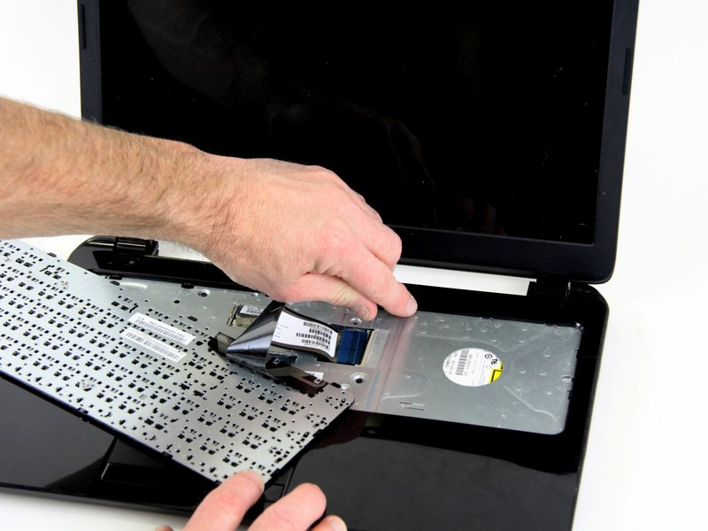

# Table of contents
- [Table of contents](#table-of-contents)
  - [Introduction ](#introduction-)
  - [Objective 1.1 - Given a scenario, install and configure laptop hardware and components.](#objective-11---given-a-scenario-install-and-configure-laptop-hardware-and-components)
    - [Parts of a Laptop](#parts-of-a-laptop)
    - [Laptop Access](#laptop-access)
    - [Keyboard Access](#keyboard-access)
    - [Hard Drive Storage](#hard-drive-storage)
    - [Comparison of HDD, SSD, and SSH](#drive-comparison)
    - [Memory](#memory)
  - [Objective 1.2 -  Compare and contrast the display components of mobile devices.](#objective-12----compare-and-contrast-the-display-components-of-mobile-devices)
  - [Objective 1.3 - Given a scenario, set up and configure accessories and ports of mobile devices.](#objective-13---given-a-scenario-set-up-and-configure-accessories-and-ports-of-mobile-devices)
  - [Objective 1.4 - Given a scenario, configure basic mobile device network connectivity and applicatoin support.](#objective-14---given-a-scenario-configure-basic-mobile-device-network-connectivity-and-applicatoin-support)
  - [Vocabulary](#vocabulary)

## Introduction 
These are my notes for Rick McDonald's CompTIA A+ Core 1 (220-1101) and Core 2 Cert Guide, **Chapter 1: Mobile Devices**.

Photo Credit: [Manny Moreno on Unsplash.com](https://unsplash.com/@mannydream)

## Objective 1.1 - Given a scenario, install and configure laptop hardware and components.
 

### Parts of a Laptop:

| Source from OEM | Source from Third-Party | Power | Unique to Laptops |
|------------------|------------------|------------------|------------------|
| Display | Optical Drives | Internal Battery | Antenna in display conneced to mini-PCIe card |
| Keyboard | Hard Drives | AC adapter| Integrated touchpad or pointing stick |
| Wireless Network Card | Memory | | Touchscreen display |
| System board| CPU | | Integrated Speakers |

### Laptop Access

General notes:
- Laptop repair will vary per manufacturer. 

Rules for Repair:
1. Refer to manufacturer documentation
   - for info on 
     - screw types
     - screw lengths
     - numbers of screws
     - cable and component locations
     - recommended tools
2. Use appropriate hand tools for case disassembly and component removal
   - Appropriate tools, used with caution, prevents damage to laptop
3. Document and label cable and screw locations
   - Take photos at different stages of dissasembly to help with reassembly
4. Organize parts
   - use a tray with multiple-compartments and a magnetic dish to prevent the loss of parts 

 

### Keyboard Access

General notes:
- Know the difference between a _touchpad_ and _pointing stick_. A laptop with a touchpad has a keyboard that is separate from the touchpad, whereas a laptop with a pointing stick has a pointing stick that is integrated with the keyboard.

How to Dissasemble a Keyboard:
1. Remove the battery and unplug the AC adapater
2. Turn laptop upright
3. Remove screws that hold keyboard in place
4. If necessary, remove keyboard bezel
5. Lift keyboard to expose keyboard cable
6. Remove any hold-down devices or connectors used to hold the keyboard cable in place
7. _Carefully_, disconnect the keyboard cable from the mother board
8. Reverse steps to install new keyboard

Photo credit: [IFIXIT](ifixit.com) 

### Hard Drive Storage

Photo credit: [Benjamin Lehman on Unsplash.com](https://unsplash.com/@benjaminlehman)

### Comparison of HDD, SSD, and SSHD:

| Type | Cost | Capacity | Speed | Reliability |
|------|------|------|------|------|
| HDD | Least expensive and readily available | Highest capacity, magnetic disk storage | Slowest b/c of moving parts | Least reliable due to moving parts that wear over time |
| SDD | Most expensive | Lowest capacity, flash memory | Fastest | No moving parts |
| SSHD | Midrange cost | High capacity w solid-state cache | Solid-state cache with slower magnetic storage | Has moving parts but spins less than HDD | 

> Q1: You are researching options for adding a hard drive to your laptop. You want speed, but price is a consideration. Which of these is the middle-of-the-road option for speed and price?
> - HDD
> - SSD
> - SSHD
> - OLED

How to remove and replace a storage device:
1. Disconnect laptop from AC power and remove the battery.
2. Remove screw(s) that hold drive cover in place.Some laptops require you to remove the entire backing to access the storage drive. 
3. Remove cover.
4. Remove screws that hold drive to chassis. 
5. If the computer uses an interposer— that is, a proprietary connector linking the drive’s SATA connector and the drive bay— remove it and save it for reuse
6. Slide the drive away
7. Remove screws fastening the drive to drive frame 
8. Remove drive from drive frame
9. Reverse steps to install new drive
10. After the system is restarted, start the computer and enter the BIOS or UEFI setup program to verify that the system has properly recognized the new hard drive

Hard drive migration How-to:
1. Creat a full backup of the computer on an external drive
2. Check to ensure that the new hard drive has enough space to hold all the data from the old hard drive
3. Copy data using disk cloning software. Remember to set the old hard drive a s the _source disk_ and set the new hard drive as the _destination disk_

### Memory 
   
> Q2: Which of these are generally accessed through the bottom of a laptop? (Choose all that apply.)
> - Battery 
> - Wireless adapter
> - SODIMM RAM
> - SSHD

## Objective 1.2 -  Compare and contrast the display components of mobile devices.
 

> Q3: Which screen type would you choose for maximum brightness and efficiency?
> - LCD with IPS 
> - OLED 
> - LCD with TN 
> - LED

## Objective 1.3 - Given a scenario, set up and configure accessories and ports of mobile devices. 
 

> Q4: Which of the following is not featured on a common docking station?
> - SSD
> - Power connection
> - USB ports
> - Display output port 
>
>Q5: Which device is most like a docking station?
> - Inverter
> - GPS
> - Port replicator
> - External HHD 

## Objective 1.4 - Given a scenario, configure basic mobile device network connectivity and applicatoin support. 

> Q6: Which term describes using a phone and USB cable to provide secure Internet access to a laptop in an airport?
> - Biometrics
> - USB Type-C
> - Tethering 
> - Two-factor authentication 

> Q7: You are using your iPhone to pay for your groceries. Your reciept is sent to your email. Which technology is used in this payment transaction?
> - ActiveSync
> - HTTPS
> - NFC
> - Hotspot

> Q8: Which transmissions cannot be enabled in airplane mode?
> - Bluetooth
> - GPS
> - Cellular
> - Wi-FI

> Q9: Which of the following is _not_ considered to be a method to avoid exceeding data limits on a phone?
> - Disabling mobile data
> - Setting syncs to Wi-Fi only
> - Not streaming music and videos
> - Disconnecting from Wi-Fi

> Q10: Which of the following are required for cloud-based synchronization on a mobile device? (Choose two.)
> - Bluetooth 4.0
> - App or web service installed
> - Web access
> - Data caps

## Vocabulary 

- **OEM**: Original Equipment Manufacturer
- **HDD**: Hard disk drive
- **SDD**: Solid-state drive
- **SSHD**: Solid-state hybrid drive 
- **Hard drive migration**: The process of copying or cloning data from an old hard drive to a new hard drive
- **BIOS**: Basic Input/Output System -  a firmware program stored on your computer's motherboard that acts like an interpreter between the operating system and the hardware devices. It's the first program that runs when you turn on your computer, initializing the hardware and preparing it for the operating system to take over.
- **SO-DIMM**: Small Outline Dual In-line Memory Module 

